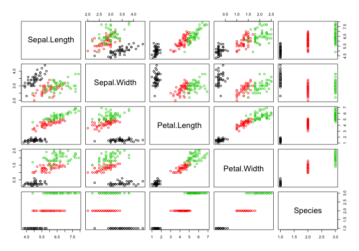

## Traditional pairs plots


```r
pairs(iris,col=iris[,5])
```

 

--- .class #id 

## A better way with the power of D3

<iframe src="pD3.html" style="overflow:hidden;height:650px;width:1500px"> </iframe>

--- &twocol 

## Comparison


*** =left

**`pairs()`**

- static image (non-interactive)
- can't easily identify observations 
- can't highlight selected observations
- doesn't interact with Shiny


*** =right

**`pairsD3()`**

- interactivity powered by D3
- identifying observations is easy with tooltips
- highlight selected of observations across all variables
- interacts with Shiny by sending the selected observations back to the server (e.g. can display them in a data table or perform analysis on a subset of observations)


---

## Get it on Github <i class="fa fa-github"></i>


```r
install.packages("devtools")
devtools::install_github("garthtarr/pairsD3")
require(pairsD3)
```

### Main functions


```r
pairsD3(iris[,1:4],group=iris[,5])
```

### Shiny interface


```r
shinypairs(iris)
```

### Check it out the preview on shinyapps.io

https://garthtarr.shinyapps.io/pairsD3-shiny

### Contribute: <a href = "https://github.com/garthtarr/pairsD3"><i class="fa fa-github"></i>/garthtarr/pairsD3</a>

<a href="https://twitter.com/garthtarr"><i class="fa fa-twitter"></i> @garthtarr</a>
